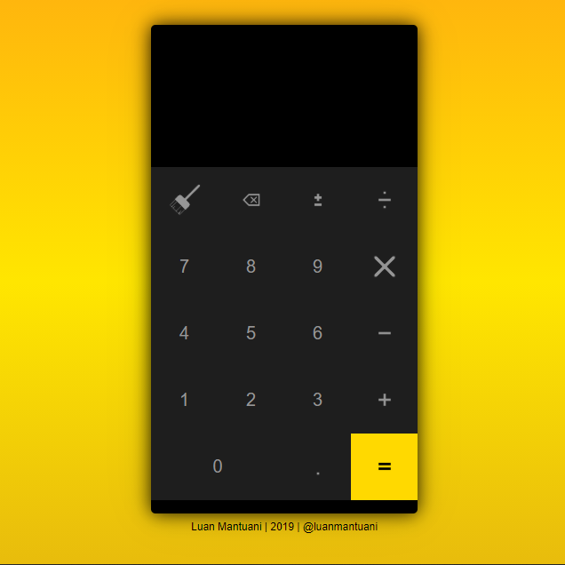

# Calculadora em JS

O projeto foi concebido com o intuito de estudar a linguagem Java Script. A calculadora possui as 4 operações básicas da matemática (adição, subtração, multiplicação e divisão), além das funções:
- Ponto flutuante
- Inverção de sinal
- Apagar número
- Limpar operação
